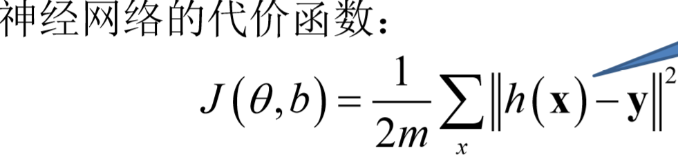
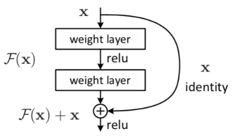

这次竞赛对于我来说难度是较大的，面对巨大的数据量，我选择了用CNN卷积神经网络进行分类识别，具体模型选用的是ResNet模型。

构建网络的主要步骤是：

① 处理图像数据和类别标签    ——>   ② 构建残差块，构建神经网络（残差网络）

——> ③ 将训练数据送入构建好的网络（选用固定大小的3 * 3的卷积核和2 * 2的池化层对数据进行卷积池化处理，将池化后的数据展开成全连接的神经网络）

——>   ④训练模型，反向传播   ——> ⑤ 保存好训练后的模型参数（权重、偏置）——> ⑥ 调用训练参数，利用softmax回归进行最后的分类处理。——> ⑦ 将预测数据写入CSV文件

 主要调用以下库实现

```python
import numpy as np
import os
import torch
import torch.nn as nn
import torch.nn.functional as F
from torch.utils.data import Dataset, DataLoader
import torchvision
from torchvision import transforms as T
from PIL import Image
```

1. 处理图片

   （1）定义Codeing类处理测试集，要处理测试集的图片数据和图片的类别标签。

   ```python
   transform = T.Compose([ 
       T.ToTensor(), 
   ])
   
   class LoadTrain(Dataset):
       
       def __init__(self, root, transform=None):
           self.root = root
           self.paths = os.listdir(root)
           self.transforms = transform   
           
       def code_lable(self, label):
           lable_cat = torch.Tensor([])
           for i in range(len(label)):
               num = ord(label[i])-48
               if num>9:
                   num -= 7
                   if num>35:
                       num -= 6
                   
               arr = torch.zeros(1, 62)
               arr[:,num] = 1
               lable_cat = torch.cat((lable_cat,arr),dim=1)
           return lable_cat
           
       def __getitem__(self, index):
           image_path = self.paths[index]    
           label = list(image_path)[:-4]
           label = self.code_label(label).reshape(310)
           
           if image_path !='.DS_Store':
               pil_image = Image.open(self.root+'\\'+image_path)
               if self.transforms:
                   data = self.transforms(pil_image)
               else:
                   image_array = np.asarray(pil_image)
                   data = torch.from_numpy(image_array)
           return data, label
   
       def __len__(self):
           return len(self.paths)
   ```

   

   ①图片数据包括图片像素和通道：

   （1）transform = T.Compose([

   ```无
   	T.ToTensor(),  # 将Image转成Tensor，归一化至 [0.0, 1.0]
   ```
   ])

   torchvision.transforms是pytorch中的图像预处理包。一般用Compose把多个步骤整合到一起：

    transforms.ToTensor() 将numpy的ndarray或PIL.Image读的图片转换成形状为(C,H, W)的Tensor张量格式，且/255归一化到[0,1.0]之间,通道的具体顺序与PIL.Image读的图片的顺序有关系PIL.Image:(R, G, B)。

   

   （2）def _ _init_ _(self, root, transform=None):
           self.root = root
           self.paths = os.listdir(root)
           self.transforms = transform 

   初始化Codeing类的参数，root表示数据集的根路径，os.listdir()将数据集的所有文件路径转化为目录结构，将图像预处理包transform赋给变量transforms方便后续使用，因为要用到pytorch所以后续所有数据都要处理成tensor类型。

   （3）定义图像类别标签的处理函数

   def code_lable(self, label):
           lable_cat = torch.Tensor([])
           for i in range(len(label)):
               num = ord(label[i])-48
               if num>9:
                   num -= 7
                   if num>35:
                       num -= 6

   ​			arr = torch.zeros(1, 62)
   ​        	arr[:,num] = 1
   ​	        lable_cat = torch.cat((lable_cat,arr),dim=1)

   ​    return lable_cat                

   torch.Tensor([]) 会调用Tensor类的构造函数__init__，生成单精度浮点类型的张量。

   图像类别标签内包含所有小写字母、所有大写字母以及0~9之间所有数字共62种类别。为了方便处理，要将类别标签转化为ASCII码值，等到最后再转化回字符值即可。

   ord()函数主要用来返回对应字符的ASCII码；

   chr()主要用来表示ASCII码对应的字符，可以用十进制，也可以用十六进制。

   在ASCII码里，48～57为0到9十个阿拉伯数字，65～90为26个大写英文字母，97～122号为26个小写英文字母。将这62个类别标签的ASCII码值减去48使它们变成数值大小在0~61范围内的值方便处理，又因为这62个标签的ASCII码值不是连续的所以为了方便处理，由于大写字母的ASCII值的最小值与数字的ASCII码值的最大值相差7就可以使数字和大写字母的值连续起来，所以要将大写字母减去48之后再减去7，对于小写字母，它的最小ASCII码值与大写字母的ASCII码值的最大值相差6就可以使大写字母和小写字母的值连续起来，但是注意要将大写字母减去48之后减去7的基础上再减去6，才可以保证最终数字、小写字母和大写字母都连接起来，这样处理完所有值以后就可以使62个类别标签的ASCI码值映射到0~61内了。

   torch.zeros(1, 62)生成一个1维的包含62个0元素的张量。

   torch.cat( (A,B),dim=1)  作用是将两个数组A、B按维数1拼接（横着拼）,这样依次可以将一个图像的类别标签中的5个字符处存入到一个数组内最终形成一个包含310（5 * 62）个元素的数组。

   

   （4）定义函数处理图片数据和类别标签。

    def __getitem__(self, index):
           image_path = self.paths[index]    
           label = list(image_path)[:-4]
           label = self.one_hot(label).reshape(310)

   ​		pil_image = Image.open(self.root+image_path)
   ​        if self.transforms:
   ​            data = self.transforms(pil_image)
   ​        else:
   ​            image_array = np.asarray(pil_image)
   ​            data = torch.from_numpy(image_array)
   ​        return data, label

   挨个遍历目录里的单个图片文件路径，读取文件路径的前五个字符作为单个图片的类别标签，将每个图片的类别标签转化成1维的含310个元素的数组，具体结构是这样的每个类别标签含5个字符，共有62个类别，故共有5 * 62个元素，在这5段里，每一段里含62个元素，对应类别标签的一个字符，假如一个图片的类别标签为'1abE2'，对于第一个字符1来说，它的ASCII码值映射在0~61范围内对应的值是1，也就是第二个位置，所以将第一段里的第二个位置的值置为1，其余位置置为0，同理，对于第二个字符a，它的ASCII码值映射在0~61范围内对应的值是10，即第11个位置，所以将第一段里的第11个位置的值置为1，其余位置置为0，其余字符同理，这样做的理由是为了梯度下降时预测损失时使用：

   

   ​	

   对于图像数据，利用Image.open()读取图片数据，将图像数据转化为张量，若transforms.ToTensor()不可用，则将图像数据转化为numpy.array类型，再从numpy.array类型转化为tensor类型。图像数据包含通道数以及宽、高。

   最后处理完所有数据后返回 图像数据和类别标签数组。

   （2）定义LoadTest类处理测试集数据

   class LoadTest(Dataset):

      ```python
   class LoadTest(Dataset):
       
       def __init__(self, root, transform=None):
           self.root = root
           self.paths = os.listdir(root)
           self.transforms = transform   
           
       def __getitem__(self, index):
           image_path = self.paths[index]
           
           if image_path !='.DS_Store':
               pil_image = Image.open(self.root+'\\'+image_path)   
               if self.transforms:
                   data = self.transforms(pil_image)
               else:
                   image_array = np.asarray(pil_image)
                   data = torch.from_numpy(image_array)
               return data 
           
       def __len__(self):
           return len(self.paths)
      ```

   

   初始化类内变量同LoadTrain类一样。

   不同的是初始化测试集图像数据只需读取处理图像数据，不用处理类别标签。

2. 构建网络 

   （1）构建残差块

   为了防止过拟合或者在预测过程中随着深度加深，正确率不增反降的现象，在构建ResNets网络时要加入残差块，其实残差网络（ResNets）是由残差块（Residual block）构建的。

   ```python
   class ResidualBlock(nn.Module):
       def __init__(self, inchannel, outchannel, stride=1):
           super(ResidualBlock, self).__init__()
           self.left = nn.Sequential(
               nn.Conv2d(inchannel, outchannel, kernel_size=3, stride=stride, padding=1, bias=False),
               nn.BatchNorm2d(outchannel),
               nn.ReLU(),
               #nn.ReLU(inplace=True),
               nn.Conv2d(outchannel, outchannel, kernel_size=3, stride=1, padding=1, bias=False),
               nn.BatchNorm2d(outchannel)
           )
           self.shortcut = nn.Sequential()
           if stride != 1 or inchannel != outchannel:
               self.shortcut = nn.Sequential(
                   nn.Conv2d(inchannel, outchannel, kernel_size=1, stride=stride, bias=False),
                   nn.BatchNorm2d(outchannel)
               )
   
       def forward(self, x):
           out = self.left(x)
           out += self.shortcut(x)
           out = F.relu(out)
           return out
   ```

   定义ResidualBlock类构建残差块，构建残差块就是我们不去学习x->F(x)的直接映射，而是去学习x到残差的映射关系，残差网络让对微小的扰动敏感性更高，也更容易训练，更适合深度较大的网络。

   “残差在数理统计中是指实际观察值与估计值（拟合值）之间的差。”“如果回归模型正确的话， 我们可以将残差看作误差的观测值。”

   如下图所示就是一个残差块：

   

   

   

   如图所示，x表示输入，F(x)表示残差块在第二层激活函数之前的输出，即 F(x)=W2σ(W1x)，其中 W1和 W2 表示第一层和第二层的权重，σ表示 ReLU 激活函数。这里省略了 偏置bias。最后残差块的输出是 σ(F(x)+x)。

   　　当没有 shortcut connection（即图右侧从 x到 ⨁的箭头）时，残差块就是一个普通的 2 层网络。残差块中的网络可以是全连接层，也可以是卷积层，我用的是卷积层。设第二层网络在激活函数之前的输出为 H(x)。如果在该 2 层网络中，最优的输出就是输入 x，那么对于没有 shortcut connection 的网络，就需要将其优化成 H(x)=x；对于有 shortcut connection 的网络，即残差块，如果最优输出是 x，则只需要将 F(x)=H(x)−x优化为 0 即可，大大降低了优化难度。

   神经网络不是越深越好，因为神经网络随着深度加深可能会退化，但是理论上，可以训练一个 shallower浅层 网络，然后在这个训练好的 shallower 网络上堆几层 identity mapping（恒等映射） 的层，即输出等于输入的层，构建出一个 deeper神经网络。

   构建这种方式确实有助于解决梯度消失和梯度爆炸问题，让我们在训练更深网络的同时，又能保证良好的性能。

   类ResidualBlock的实现过程：类ResidualBlock继承了nn.Module这个类, 我们可以转到nn.Module这个父类里面包含很多方法，而且其中有__init__(self)和forward(self) 这两个函数，因此其实类ResidualBlock内的就是对父类nn.Moudle重写。如果想要一些自己定义的一些外面参数，那么我们就需要在__init__(self)中添加一些外部参数，然后变成这样def __init__(self, inchannel, outchannel, stride=1)，但是仍然需要继承nn.Module.__init__(self)的相关方法，所以就要使用super(ResidualBlock, self).__init__()， 如果不使用super而显示调用父类的初始化函数，就会出现多次初始化的问题，会降低代码的执行效率。
   	**init**()相当于是我们的名词，然后forward()是我们的动作，就比如定义一个网络,**init**()定义我们的网络有哪些层，但是没有定义网络是如何定义的，而forward()定义网络是如何连接起来的。

   在forward（）里，shortcut存在二种不同的类型，一种是经过网络之后输出和输入尺寸是一样的，还有一种输出和输入的维度不匹配，这个时候我们通过Conv + BN的方法将输入的尺寸变成输出尺寸。

   

   nn.Conv2d(类式接口)

   Input Channels：  指输入图像的通道数（如灰度图像就是1通道，RGB图像忽略alpha通道后就是3通道）。

   Kernel Channels：不是一个值，它是两个值组成的一组值，表征了这个卷积核将输入图像从多少个通道映射到多少个通道上，可以是int，或tuple；kennel_size=2,意味着卷积大小2， kennel_size=（2,3），意味着卷积在第一维度大小为2，在第二维度大小为3；
   这里说种其实是想说，实际用的卷积核数量是Input Channels乘以后面的这个"卷积核种数"。也就是说对于每种卷积核都按照输入通道数分成了不同通道上的卷积核，对于不同通道上的同种卷积核：它们不共享权值，但共享一个偏置。
   Kernel Size：指卷积核的长宽，如为3则卷积核是3乘3的。
   Stride：        指每次移动卷积核的步长，显然这个值会大幅影响输出的Feature Map的shape。
   Padding：   指为输入图像外围补充的圈数，注意如28乘28的图像，补充Padding=1就变成30乘30的了（而不是29乘29）。这个值一般直接在卷积时候定义，不必手动为输入图像加Padding。

   

   nn.BatchNorm2d(out_channel)    

   BatchNorm2d最常用于卷积网络中(防止梯度消失或爆炸)，设置的参数就是卷积的输出通道数。

   

   nn.ReLU和F.ReLU都是激活函数，但是又有区别

   其中nn.ReLU作为一个层结构，必须添加到nn.Module容器中才能使用，而F.ReLU则作为一个函数调用，看上去作为一个函数调用更方便更简洁。具体使用哪种方式，取决于编程风格。在PyTorch中,nn.X都有对应的函数版本F.X，但是并不是所有的F.X均可以用于forward或其它代码段中，因为当网络模型训练完毕时，在存储model时，在forward中的F.X函数中的参数是无法保存的。也就是说，在forward中，使用的F.X函数一般均没有状态参数，比如F.ReLU，F.avg_pool2d等，均没有参数，它们可以用在任何代码片段中。

   

   （2）构建完残差块，就要构建基于残差块的残差网络了。

   构建ResNet网络：

   ```python
   class ResNet(nn.Module):
       def __init__(self, ResidualBlock, num_classes=310):
           super(ResNet, self).__init__()
           self.inchannel = 64
           self.conv1 = nn.Sequential(
               nn.Conv2d(3, 64, kernel_size=3, stride=1, padding=1, bias=False),
               nn.BatchNorm2d(64),
               nn.ReLU(),
           )
           self.layer1 = self.make_layer(ResidualBlock, 64,  2, stride=1)
           self.layer2 = self.make_layer(ResidualBlock, 128, 2, stride=2)
           self.layer3 = self.make_layer(ResidualBlock, 256, 2, stride=2)
           self.fc = nn.Linear(4608, num_classes)
   
       def make_layer(self, block, channels, num_blocks, stride):
           strides = [stride] + [1] * (num_blocks - 1)
           layers = []
           for stride in strides:
               layers.append(block(self.inchannel, channels, stride))
               self.inchannel = channels
           return nn.Sequential(*layers)
   
       def forward(self, x):
           out = self.conv1(x)
           out = self.layer1(out)
           out = self.layer2(out)
           out = self.layer3(out)
           out = F.avg_pool2d(out, 4)
           out = out.view(out.size(0), -1)
           out = self.fc(out)
           return out
       
   def ResNets():
       return ResNet(ResidualBlock)
   ```

   跟ResidualBlock类一样，ResNet类也是继承重写了nn.module父类。

   自主定义输入层的通道数为64，然后nn.Sequential定义一个容器，规定了卷积操作以便于搭建隐藏层神经网络。接着开始构建layer，layer是由自定义函数make_layer()函数实现的，根据数据的大小，步长可能为1，也可能为2，所以要给make_layer()函数传一个步长进去，计算后判断步长是否改变。

   查阅资料，大部分ResNet网络都会多增加几层隐藏层，将通道数处理最后为512，但是我在训练时会发现我处理到256的效果比512的效果好一些。

   在隐藏层卷积完成后，最后将数据展开成全连接神经网络，方便进行反向传播。

   对于nn.Sequential(*layers)：如果*号加在了是实参上，代表的是将输入迭代器拆成一个个元素。

   forward()函数进行构建网络，返回卷积后的数据。

   最后再ResNets函数里将残差块传入神经网络，残差网络就构建完成了。

   

3. 训练模型 

   ```python
   def training():
       data = LoadTrain('train/train', transform)
       dataloader = DataLoader(data, batch_size=32, shuffle=True, drop_last=False)
       img, label = data[0]
       
       cnn = ResNets()
       
       loss_fn = nn.MultiLabelSoftMarginLoss()
       optimizer = torch.optim.Adam(cnn.parameters())
       
       for i in range(8):  
           for j,(img,labels) in enumerate(dataloader):
               out = cnn(img)
               loss = loss_fn(out, labels)
               optimizer.zero_grad()
               loss.backward()
               optimizer.step()
               if j % 100 == 0:
                   print('i=%d j=%d Loss: %.5f' %(i,j,loss.item()))
       
       torch.save(cnn.state_dict(),'parameter.pt')
       
       return
   ```

   先读取数据，因为数据量太大，所以设置batch-size分批跑数据，在这里我设置成32，我试过64，但是电脑带不动，先调用ResNets构建网络，然后定义损失函数和优化器对象Optimizer，然后设置大概的迭代次数，步骤依次为先前向传播、计算损失、将导数清零、最后反向传播。

   最后将训练好的参数保存进parameter.pt文件：pytorch 中的 state_dict 是一个简单的python的字典对象,将每一层与它的对应参数建立映射关系.(如model的每一层的weights及偏置等等)(注意,只有那些参数可以训练的layer才会被保存到模型的state_dict中,如卷积层,线性层等等)

   load_state_dict 也是model或optimizer之后pytorch自动具备的函数,可以直接调用

   state_dict 是一个python的字典格式,以字典的格式存储,然后以字典的格式被加载,而且只加载key匹配的项

   

4. 预测

```python
def uncode(code):
    tabel = []
    for i in range(len(code)):
        if code[i]<10:
            tabel.append(chr(code[i]+48))
        elif 10<=code[i]<36:
            tabel.append(chr(code[i]+55))
        else: 
            tabel.append(chr(code[i]+61))
    return tabel

def main():
    data = LoadTest('test/test', transform)
    cnn = ResNets()
    cnn.load_state_dict(torch.load('parameter.pt'))
    cnn.eval()

    prediction = []
    
    for i in range(len(data)):
        imgs = data[i]
        imgs = torch.Tensor(imgs).reshape(1,3,30,150)
        output = cnn(imgs)
        output = output.view(-1, 62)
        output = nn.functional.softmax(output, dim=1)
        output = torch.argmax(output, dim=1)
        out = uncode(output)
        print(out)
        prediction.append(out)
        
    m = len(prediction)
    labels = [[] for i in range(m)]
    for i in range(m):  
            labels[i].append(i)
            labels[i].append(prediction[i])
            
    np.savetxt('sample_data2.csv',labels, fmt='%s')


```

读取测试集，加载训练好的权重、偏置参数，构建ResNets网络，利用softmax回归进行最终的预测，最后将预测结果写成要求上传的格式的二维数组，然后将数据写入文件。